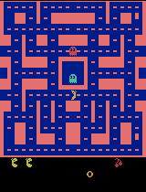
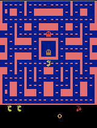
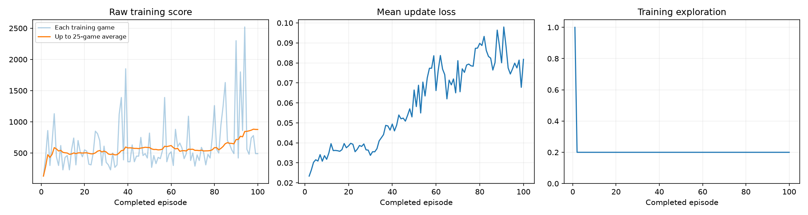

# Class 3 Assignment: Train a Ms. Pac-Man Agent (DQN)

A Deep Q-Network (DQN) trained on Atari Ms. Pac-Man using the course's ready-made notebook.
I chose three hyperparameters, ran the notebook once end-to-end, and report every number below
from the run's own output files (linked in the [Evidence](#evidence) section).

**Result in one line:** mean evaluation score went from **492.0 (untrained) to 680.0 (trained)**, a
**+188.0** change across the same five fixed games. Four of five games improved; one got worse.

---

## How to open and run the notebook

1. Open [`pacman_dqn.ipynb`](pacman_dqn.ipynb) in Jupyter, VS Code, or Google Colab (Colab: **Runtime → Change runtime type → T4 GPU**).
   Use a Python 3.11–3.13 kernel.
2. The three settings are in **section 1** (`EXPLORATION`, `EPISODES`, `LEARNING_RATE`). This repo's copy already contains my values.
3. **Run All**. Section 2 installs packages; the notebook then evaluates the untrained network, trains, evaluates again, and zips the results into `pacman_runs/<timestamp>/`.
4. The notebook in this repo is the executed final-run version with all outputs (scores, plot, GIFs) visible.

<details>
<summary>How I ran it locally (macOS, no Colab)</summary>

```bash
# Python 3.12 via uv, then the notebook's own package pins plus Jupyter
uv python install 3.12
uv venv --python 3.12 .venv
uv pip install --python .venv/bin/python "torch>=2.6,<3" "gymnasium==1.3.0" "ale-py==0.11.2" \
  "opencv-python-headless==4.14.0.94" "numpy>=2,<3" "matplotlib>=3.9,<4" "Pillow>=10,<13" jupyter papermill pip
# Execute every cell in order and keep outputs
.venv/bin/papermill pacman_dqn.ipynb pacman_dqn.ipynb --kernel python3 --log-output --execution-timeout -1
```
</details>

---

## My three hyperparameters

| Setting | Value | Why I chose it |
|---|---|---|
| **Exploration** | `0.20` | 20% random moves after warm-up. The notebook's default and a middle ground: enough randomness to keep discovering new maze situations, while the network still plays its own policy 80% of the time so replay memory reflects what it actually does. |
| **Episodes** | `100` | The notebook's default and enough to clear the 1,000-decision warm-up many times over. It also crosses the 25-episode threshold four times, so I get intermediate GIFs and checkpoints at episodes 25/50/75/100 to see *when* behavior changed. |
| **Learning rate** | `0.00025` | 2.5× the reference value of `0.0001`. With only 100 short games (~14k updates), I wanted each update to move the weights enough for change to be visible, without going as far as `0.001`, which risks unstable Q-values and a non-finite loss. |

Only these three lines in section 1 were edited. Evaluation settings (5 seeds `[101, 202, 303, 404, 505]`,
5% exploration, 3,000-decision time limit) are unchanged and identical before and after training.

---

## What I expected vs. what happened

**Expected:** A modest improvement in mean score—maybe +100 to +200 points—because 100 episodes is
tiny by DQN standards (the original paper used millions of frames). I expected the 25-game training
average to creep upward, the trained agent to survive longer and eat more pellets than the untrained one,
and a lot of game-to-game noise. I expected the slightly higher learning rate to make progress visible
sooner than `0.0001` would.

**Observed:**

- **Mean evaluation score rose 492.0 → 680.0 (+188.0)**, inside my expected range.
- The training curve was **flat for ~80 episodes** (25-game average hovering 500–600), then climbed
  sharply to **877.2** over the last 20 episodes, with several 2,000+ point training games. Most of the
  learning that shows up in the score happened late in the run.
- **Improvement was not uniform:** game 4 (seed 404) fell from 800 to 300. The untrained network happened
  to do well on that seed; the trained policy did not.
- Trained games lasted longer: evaluation decision counts went from `[560, 597, 614, 640, 534]` to
  `[934, 649, 828, 654, 972]`. No game hit the time limit before or after.
- **Mean update loss went *up*** (≈0.02 → ≈0.09) while scores improved. This is expected in DQN: as the
  agent starts collecting more reward, its value targets grow and the regression problem gets harder.
  Lower loss ≠ better play, as the notebook warns.
- In the GIFs, the untrained agent (`episode_0000.gif`) mostly circles the lower-left of the maze and
  ends its 20-second clip at 350 points. The best trained game (`final_best.gif`, seed 505, 1,060 points)
  travels through more of the maze, clears more corridors, and is still alive at 440 points when the
  clip ends.

### Evaluation scores (same 5 seeds, 5% exploration, before vs. after)

Source: [`results/comparison.json`](results/comparison.json)

| Game | Seed | Before (untrained) | After (trained) | Change |
|---:|---:|---:|---:|---:|
| 1 | 101 | 350 | 840 | +490 |
| 2 | 202 | 500 | 790 | +290 |
| 3 | 303 | 320 | 410 | +90 |
| 4 | 404 | 800 | 300 | **−500** |
| 5 | 505 | 490 | 1060 | +570 |
| **Mean** | | **492.0** | **680.0** | **+188.0** |

Time-limited games before / after: 0 / 0. The baseline is an **untrained network**, not a random-action agent.

### Intermediate demonstration scores (seed 101 only, one game each)

Source: [`results/demo_scores.json`](results/demo_scores.json)

| Episode | 25 | 50 | 75 | 100 |
|---|---|---|---|---|
| Score | 220 | 770 | 480 | 840 |

---

## Actual training budget and hardware

Source: [`results/training_summary.json`](results/training_summary.json), [`results/config.json`](results/config.json)

| | |
|---|---|
| Status | `completed` (not interrupted) |
| Completed episodes | **100 / 100** |
| Total decisions | **57,801** |
| Learning updates | **14,201** (first update in episode 2, after the 1,000-decision warm-up) |
| Elapsed time | **195.6 s ≈ 3.3 minutes**, including the four periodic demos |
| Hardware | Apple M3 Pro (MacBook Pro), 18 GB RAM, PyTorch `mps` backend (Apple GPU) |
| Software | macOS 15.7.4, Python 3.12.14, torch 2.14.0, gymnasium 1.3.0, ale-py 0.11.2, numpy 2.5.3 |
| Training games that hit the time limit | 0 of 100 |

---

## What the agent observes, does, and is rewarded for

- **Observations (what it sees):** not the color screen we see, but **four consecutive grayscale
  84 × 84 game screens** stacked together. One screen is a still photo; four in a row let the network
  tell which way Ms. Pac-Man and the ghosts are moving. Every four emulator frames it takes one look.
- **Actions (what it can do):** one of the 9 Atari joystick positions—up, down, left, right, the four
  diagonals, or no-op. The network outputs one number per move: its estimate of how many future points
  that move leads to. During training it picks the highest-value move 80% of the time and a random one 20%
  of the time; during evaluation it is 95% / 5%.
- **Rewards (how it learns):** the **change in game score** after each move—pellets, power pills, ghosts,
  fruit. For the learning update the reward is clipped to −1…+1 so one big fruit bonus doesn't swamp
  everything, but every score reported here is the real, unclipped game score. The network is nudged so
  that its value for the chosen move gets closer to `reward + 0.99 × (best value of the next screen)`.
  The agent never sees rules, maze maps, or ghost positions as numbers—only pixels and points.

---

## One limitation I observed

**Five evaluation games is too few to trust the +188 mean.** The per-game changes range from −500 to
+570, so the variance is as large as the effect. One seed (404) got much worse. And the training curve was
flat for 80% of the run before jumping in the last 20 episodes, so it's unclear whether that late spike is
durable learning or a lucky stretch. A related limitation is the small 5,000-transition replay memory:
with ~600 decisions per game, it only holds the last ~8 games, so the agent quickly "forgets" earlier
experience.

## Next experiment

**Change only `EPISODES` from 100 to 500**, keeping exploration at 0.20 and learning rate at 0.00025.
Reason: the score curve was still rising steeply when the run ended, and the run took only 3.3 minutes on
this hardware, so 5× the episodes costs about 17 minutes. If the improvement is real, the 25-game average
should keep climbing past 877 and the five-game evaluation mean should rise well above 680; if it was a
lucky late streak, the average should fall back. Either outcome answers the question raised by the limitation above.

---

## Evidence

### Gameplay

Untrained network (episode 0, seed 101, 350 points in the full game):



Best trained game (seed 505, 1,060 points — best of the five final evaluation games):



Intermediate demonstrations (seed 101; one game each, first 20 seconds):

| Episode 25 (220) | Episode 50 (770) | Episode 75 (480) | Episode 100 (840) |
|---|---|---|---|
|  |  |  |  |

### Training plot

Raw training score with 25-game average, mean update loss per episode, and training exploration (100% during warm-up, then constant 20%):



### Files

| File | What it is |
|---|---|
| [`pacman_dqn.ipynb`](pacman_dqn.ipynb) | Executed final-run notebook with all outputs |
| [`results/config.json`](results/config.json) | My three settings plus every fixed setting, hardware, and package versions |
| [`results/training.csv`](results/training.csv) | Per-episode score, steps, cumulative decisions, mean loss, elapsed time |
| [`results/training_summary.json`](results/training_summary.json) | Status, completed episodes, decisions, learning updates, elapsed seconds |
| [`results/comparison.json`](results/comparison.json) | All five before/after evaluation scores, means, lengths, seeds |
| [`results/baseline.json`](results/baseline.json) | Untrained evaluation only |
| [`results/demo_scores.json`](results/demo_scores.json) | Intermediate demonstration scores at episodes 25/50/75/100 |
| [`results/training_dashboard.png`](results/training_dashboard.png) | Training plot |
| [`results/demos/`](results/demos/) | All six GIFs |
| [`tools/summarize_run.py`](tools/summarize_run.py) | Script that prints the numbers above from the run folder and copies evidence into `results/` |

**Model checkpoints** (`untrained.pt`, `episode_0025.pt`, `episode_0050.pt`, `episode_0075.pt`,
`episode_0100.pt`, `trained.pt`; ~6.4 MB each) are kept out of the repository's git history. They are
in the full run ZIP `pacman_runs/20260915_204142_814964.zip` (36 MB), which is available in two places:
attached as a file on this repo's **[GitHub Release](../../releases)**, and kept locally on my machine.
The ZIP also contains every file in `results/`. Each checkpoint stores the network weights, `n_actions`, episode, decision count, and
my exploration/learning-rate settings, and can be loaded with `torch.load(..., weights_only=True)` for playback.

This run was **not interrupted** and **did** perform learning updates (14,201).
